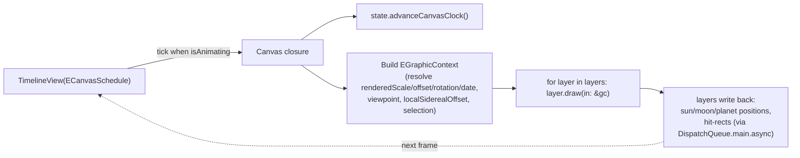

# Ephoemerous — Architecture Roadmap

A map of the codebase for code review. 118 active Swift files (161 incl. DeprecationStation / Concepts / Mockups, which are excluded here).

The app is a SwiftUI planetarium: an observer-centred stereographic sky projected into a `Canvas`, driven by a single `@Observable` state object, with Apple-Maps-style chrome (toolbar, search, detail sheets) and device-motion ("point at the sky") features.

---

## 1. The five subsystems

```mermaid
flowchart TB
    subgraph CHROME["UI Chrome (SwiftUI)"]
        MainView --> Toolbar & Search & Detail & Overlay[ObjectsTrackingOverlay]
    end
    subgraph RENDER["Render pipeline"]
        Canvas[CelestialCanva] --> Layers["14 EGridLayers"]
    end
    subgraph TOOLKIT["Drawing toolkit + input"]
        EArtist --> Palette[EPalette]
        Gestures[CelestialGestureCoordinator]
    end
    subgraph STATE["State hub"]
        EAppState
    end
    subgraph MODEL["Model + math + services"]
        Projection["EProjection / EPrecession / EGraphicContext"]
        Positions["Sun/Moon/Planet positions"]
        Data["StarDatabase / ConstellationLines"]
        Services["Location / Motion / Weather / CloudSync"]
    end

    CHROME -->|reads/writes| STATE
    Canvas -->|snapshots| STATE
    Layers -->|draw via| EArtist
    Layers -->|project via| Projection
    Gestures -->|writes offset/scale/rotation| STATE
    Canvas -->|per-frame snapshot| Projection
    STATE -->|reads| Services
    STATE -->|reads| Data
    Projection --> Positions
    Services -.->|@Observable wakes| Canvas
```

**Dependency direction:** Chrome & Render depend on State; State depends on Model & Services; Model is leaf (pure math + data). EArtist is a styling namespace used by layers and some chrome.

---

## 2. The frame loop (the heart)



- **`CelestialCanva`** hosts a `TimelineView` with a custom **`ECanvasSchedule`**: ticks at 120fps while `isAnimating`, parks at `.distantFuture` when idle.
- **`isAnimating` drivers** (OR'd): `gestures.isInteracting`, `_activeTransition`, `_dateTransition`, `_originTransition`, `_inertiaTransition`, `_rotationTransition`, `_promotionActive`. (Motion wakes the canvas separately via `@Observable` reads of `EMotionService.aim`.)
- **`EGraphicContext`** = the per-frame snapshot. Resolves all observable state **once** so the ~2–9k-star hot loops never touch the observation graph. Carries `toScreen()`, `screenPoint(azimuth:altitude:)`, `makeStarCull()`, `poiPromotion()`, `resolve(Color)`.

### Projection chain (celestial → screen)
`EPrecession.precess(ra,dec,to:date)` → `EPrecession.equatorialVector` → `.sidereallyRotated(by: localSiderealOffset)` (LoreKit) → `EProjection.project(_, viewpoint:)` (stereographic, returns nil behind viewer) → `EGraphicContext.toScreen` (applies canvasRotation, ×scale, +offset; **North up, East left** — inside-the-dome convention).

> **Perf note:** `StarsLayer` caches the projection-unit points keyed by `(date, origin)` in `state._starProjPoints`; pan/pinch/rotate replay `toScreen` only. `precess` caches its rotation matrix per date. Planet/Sun/Moon positions cache by `(date, siderealOffset)`.

---

## 3. Layer stack (draw order, bottom → top)

| # | Layer | Draws | Gating | Publishes hit-rect / reads motion |
|---|-------|-------|--------|------|
| 1 | `UserLocationLayer` | "you are here" globe puck at zenith | `isAtDeviceLocation` | — |
| 2 | `EarthGridLayer` | RA/Dec graticule, pole/hour labels, **aim-cone highlight** | aim-cone: at-location + live aim | reads `EMotionService.aim` |
| — | ~~`SkyAimWashLayer`~~ | blue aim wash | **commented out** | reads aim |
| 3 | `ConstellationLinesLayer` | stick-figure segments (fav-tinted) | — | — |
| 4 | `StarsLayer` | generic star field (~2k, projection-cached) | magnitude cap by zoom; skips fav/named | — |
| 5 | `ConstellationNamesLayer` | constellation labels (3 tiers) | tier by zoom | `constellationLabelHitRects` |
| 6 | `NamedStarsLayer` | ~300 named-star POI badges | `namedStarDotIn`, brightness tiers | `namedStarHitRects` |
| 7 | `FavouritesLayer` | favourite stars (heart + badge) | badge by zoom | `favouritePositions` |
| — | ~~`EclipticLayer`~~ | zodiac ecliptic rim | **commented out** | — |
| 8 | `EPlanetsLayer` | 7 planet POI badges | margin cull; dot below badge-in | `planetPositions` |
| 9 | `SunLayer` | Sun POI badge | — | `sunScreenPosition` |
| 10 | `EMoonLayer` | Moon POI badge (phase glyph) | margin cull | `moonScreenPosition` |
| 11 | `HorizonLayer` | twilight bands + scalloped rim | — | — |
| 12 | `HorizonLabelsLayer` | "EASTERN/WESTERN HORIZON" curved text | — | — |

Protocol: `EGridLayer { func draw(in dc: inout EGraphicContext) }`, with `artist` (= `EArtist.shared`) available by default.

---

## 4. EAppState — the hub

Single `@Observable`. Property groups, each with a committed value, an optional transition, and a `rendered*` accessor read by the canvas:

| Group | Committed | Transition | Rendered |
|-------|-----------|-----------|----------|
| Rotation | `canvasRotation`, `compassMode` | `_rotationTransition` (bounce) | `renderedRotation` (compass = `-aim.azimuth`) |
| Zoom/Pan | `scale`, `offset` | `_activeTransition` (bounce), `_inertiaTransition` (fling) | `renderedScale`, `renderedOffset` |
| Time | `observationDate` | `_dateTransition` (smoothstep) | `renderedObservationDate` |
| Origin | `origin`, `plane` | `_originTransition` (slerp) | `originVector`/`planeVector`/`viewpoint` |
| Selection | `detailDestination`, `mythDestination` | `_selectionStart`/`_deselectStart`/`_promotionActive` | `poiPromotion()` |

Extensions split by concern: `+CanvasClock` (the tick state machine), `+Detail` (focus/pan/sheet swap), `+Space` (vectors/sidereal/setOrigin), `+Stars` (cache + magnitude cap), `+Time`, `+Location`, `+Viewport` (offset clamping/rubber band), `+Favourites`, `+Locality`, `+Persistence`. `FocusPreset.swift` adds the rotation + viewport animation primitives (`animateTo`, `animateRotation`, `toggleCompassMode`, `resetRotationToNorth`).

---

## 5. Key flows

**Tap → detail:** `ObjectsTrackingOverlay` (invisible hit-rects from published positions) → `onTap` → `state.focus(on:)` → sets `detailDestination` + `panTo()` + `recordViewed()` → `MainView .sheet(item:)` → `DetailHost` routes by enum → `E{Sun,Moon,Star,Planet,Constellation}DetailView`.

**Sheets (mutually exclusive):** `detailDestination`, `mythDestination`, `isShowing{Date,Location}Picker` each bind a sheet; `searchPresented` is a derived binding = "nothing else open" so `SearchSheet` is the persistent fallback.

**Gestures:** `CelestialGestureView` (UIViewRepresentable, 4 UIKit recognizers; pan+pinch+rotate simultaneous, hold exclusive) → `CelestialGestureCoordinator` (pure math, writes `offset`/`scale`/`canvasRotation`). Sub-files: `+Pan +Pinch +Rotation +DoubleHold +Inertia +Rubber +Math`. Rotation has a ±7° North detent; rotation is locked while `compassMode`.

**Motion / compass:** `EMotionService.sample(from:)` blends device top-edge (+Y) ↔ back-normal (−Z) by screen-down-ness → `aim`; publishes hysteretic `raisedToSky`. `MainView` engages compass mode on raise. `renderedRotation` follows `-aim.azimuth` in compass mode. `EarthGridLayer` lights up the graticule inside the aim wedge (`EArtist.aimConeWedge`).

**POI label engine** (`EArtist+POI*`): `poiStyle(for:)` → 3 tiers (`labelTierProgress`/`labelTierScale`) → `drawPOILabel` (dot→badge→text) with `promotion` (0→1, `poiSelectProgress`) lifting/scaling the selected pin. Shared by stars, named stars, sun, moon, planets, constellations, and `POIBadgeView` (the SwiftUI twin in detail sheets).

---

## 6. Suggested review order

1. **Foundations:** `AstroConstants`, `Angle+Ext`, `SIMD3+Ext` → `EPrecession` → `EProjection` → `EGraphicContext`. (Everything visual rests on these.)
2. **State core:** `EAppState` + `FocusPreset` + `+Space` + `+CanvasClock`. (The transition/rendered model.)
3. **Frame loop:** `CelestialCanva` + `EGridLayer`, then `StarsLayer` (the perf-critical one) → the other layers.
4. **Toolkit:** `EArtist` + `EArtist+POIStyle/POILabel/POITiers/POISelection` (the label engine), then per-feature `EArtist+*`.
5. **Input:** `CelestialGestureView` + `CelestialGestureCoordinator(+*)`.
6. **Services:** `ELocationService`, `EMotionService`, `ECloudSync`, then `EAppState+Detail/Location/Time/Persistence`.
7. **Chrome:** `MainView` → `ObjectsTrackingOverlay` → `SearchSheet` → `Toolbar/*` → `Detail/*` → `List/DetailViews/*`.

---

## 7. Cleanup candidates (flag while reviewing)

- **Commented-out layers:** `SkyAimWashLayer`, `EclipticLayer` (still compiled, not in stack).
- **Unused seams:** `EArtist.drawAimCone` / `drawHeadingCone` (cone moved to grid highlight); `roseShape`/`roseCorners`/`roseBulge` in `CompassButton` (now a circle); `EAppState.dial` empty computed in `CompassButton`.
- **Possibly dead:** `EWeatherService` (background switched to local sun-altitude math — confirm callers); `EZodiacSign` (stub, unused); `UserLocationPuck` (SwiftUI twin of the procedural puck — confirm if mounted).
- **Identity vs display:** `EStar.id = UUID()` is per-launch (recents re-key by name on restore) — verify no persistence relies on it.

---

_Generated as a review roadmap. Regenerate after large refactors._
